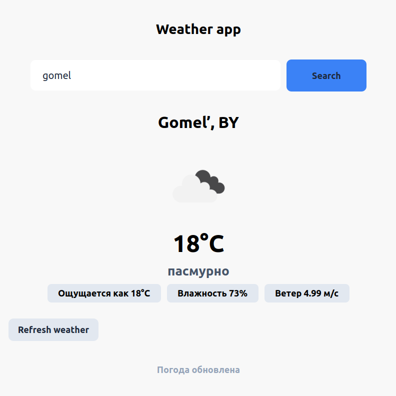

# Weather App (Qt/C++)

Приложение для просмотра текущей погоды в любом городе. Использует бесплатное API OpenWeatherMap.



## Возможности

- Поиск погоды по названию города
- Отображение температуры, влажности, скорости ветра
- Иконка погоды (солнце, облака, дождь и т.д.)
- Кнопка обновления

## Стек технологий

- **C++ (Qt 6/5)**
- **Qt Network** — HTTP-запросы к API
- **JSON** — парсинг ответов
- **CMake** — система сборки

## Как собрать и запустить

### Требования
- Qt 5.15 или выше
- CMake 3.5+

### Сборка и запуск

```bash
mkdir build && cd build
cmake ..
make
./weather-app-qt
